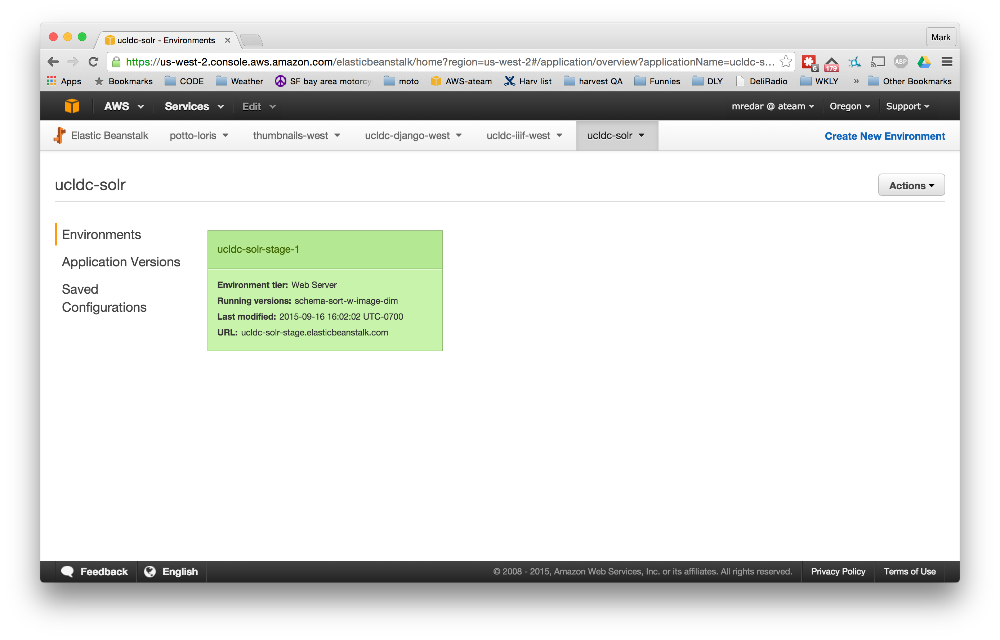
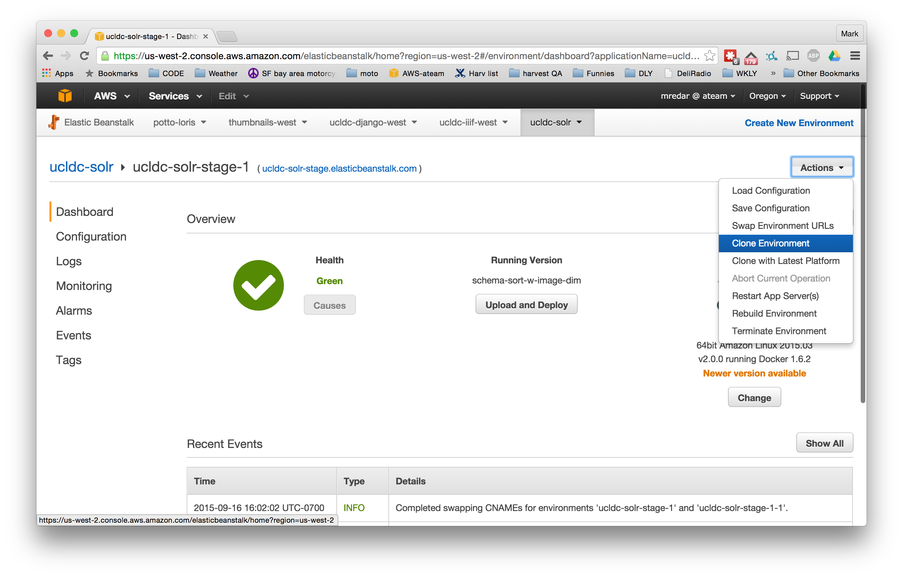
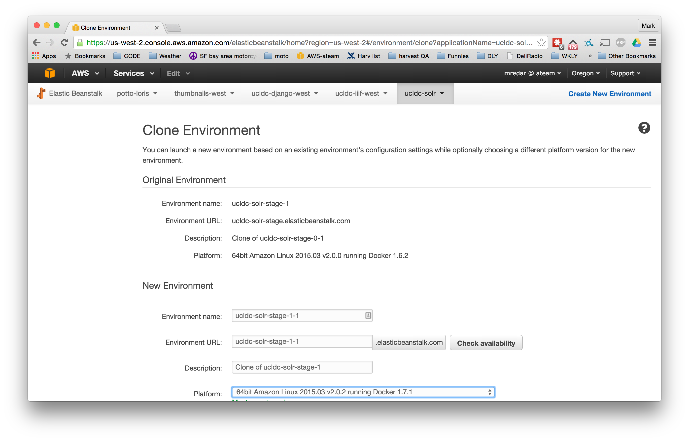
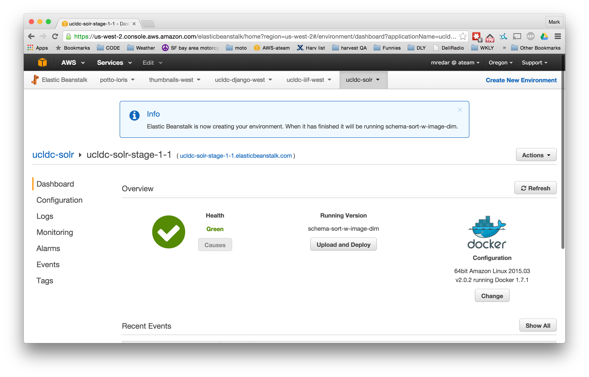
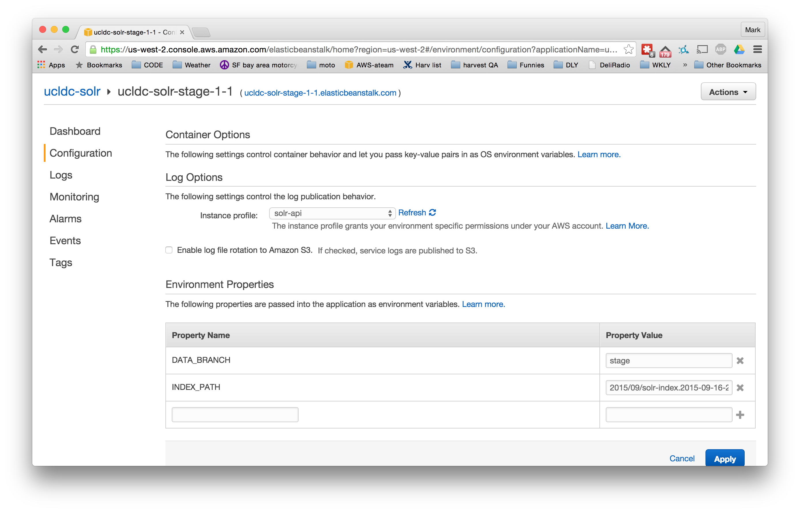
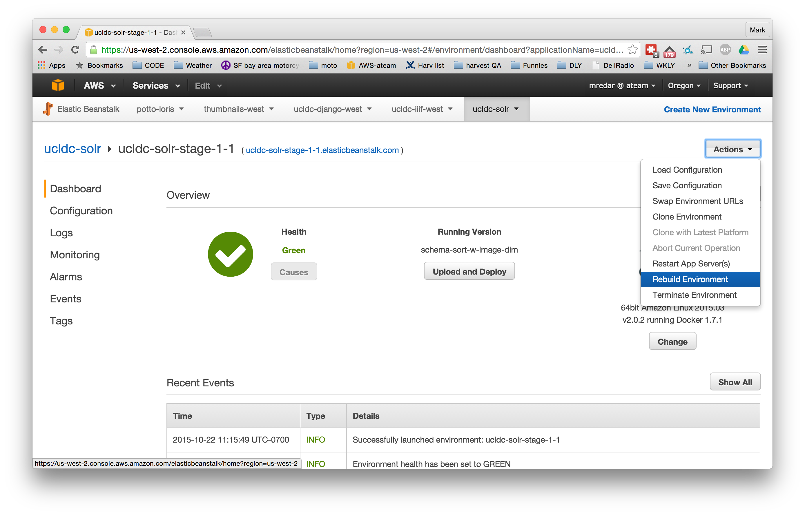
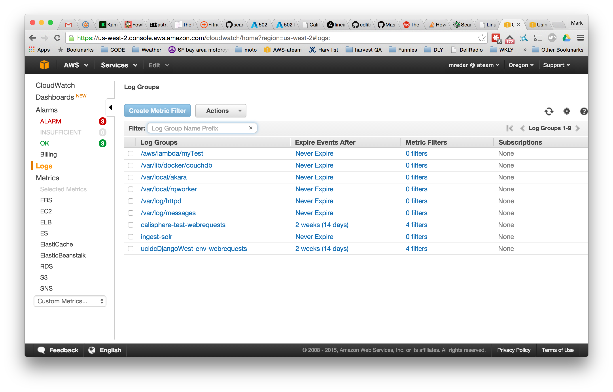
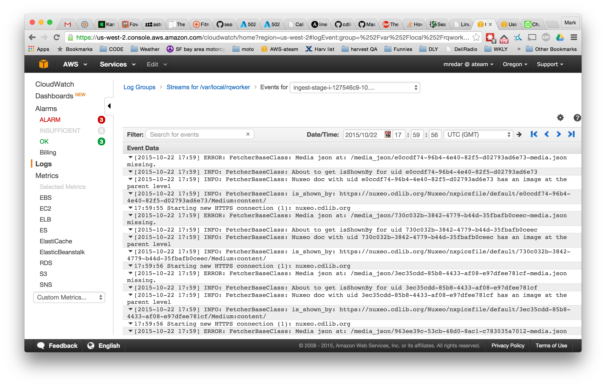

<b>Harvesting infrastructure components</b>

<i>Consult the <a href="https://docs.google.com/drawings/d/18Whi3nZGNgKQ2qh-XnJlV3McItyp-skuGSqH5b_L-X8/edit">harvesting infrastructure diagram</a> for an illustration of the key components.  Ask Mark Redar for access to them; note that you will need to log onto the ingest front machine and then into the majorTom machine to run commands, using these <a href="https://sp.ucop.edu/sites/cdl/apg/OACCalisphere%20docs/dsc_putty_connection_instructions.docx">Putty connection  instructions</a> (on Sharepoint)</i>

* <a href="https://registry.cdlib.org/admin/library_collection/collection/">Collection Registry</a> 
* ingest front machine (stage - 52.10.100.133) and ingest front machine (production - 52.11.194.40), for access to:
 * <a href="https://52.10.100.133/rq/">RQ Dashboard</a>
 * <a href="https://52.10.100.133/couchdb/_utils/database.html?ucldc/_all_docs">CouchDB stage</a>  
 * <a href="https://52.11.194.40/couchdb/_utils/database.html?ucldc/_all_docs">CouchDB production</a>
 * <a href="https://52.10.100.133/solr/#/dc-collection/query">Solr stage</a> 
 * <a href="https://52.11.194.40/solr/#/dc-collection/query">Solr production</a> 
* Elastic Beanstalk 
* <a href="https://aws.amazon.com/console/">AWS CloudWatch</a>

As of February 2016, the process to publish a collection to production is as follows:

1. Create collection, add harvest URL & mapping/enrichment chain
2. Select "Queue harvest for collection on normal queue" on the registry page for the collection
3. Check that there is a worker listening on the queue. If not start one. [Stage Worker](#createstageworker)
4. Wait until the harvest job finishes, hopefully without error.  Now the collection has been harvested to the **stage CouchDB**.
5. The first round of QA in CouchDB can be performed there <a href="https://52.10.100.133/couchdb/_utils/database.html?ucldc/_all_docs">CouchDB stage</a>
6. Push the new CouchDB docs into the stage Solr index. [Updating Solr](#solrupdate)
7. QA **stage Solr** index in the public interface <a href="https://52.10.100.133/solr/#/dc-collection/query">Solr stage</a>
8. When ready to publish to production, edit Collection in the registry and check the "Ready for publication" box and save.
9. Select the "Queue sync to production couchdb for collection" [Syncing CouchDB](#synccouch)
10. Check that there is a worker in the production environment listening on the normal prod queue, if not start one. [Production Worker](#createprodworker)
11. Wait until the sync job finishes.  Now the collection has been harvested to the **production CouchDB**.
12. Sync the new docs to the **production Solr** by running the solr update on the production majorTom. At this point the Collection is in the *<a href="https://52.11.194.40/solr/#/dc-collection/query">new, candidate Calisphere Solr index</a>*
13. Once QA is done on the candidate index and ready to push new one to Calisphere, [push the index to S3](#s3index)
14. Clone the existing Solr API Elastic Beanstalk and point to the packaged index on S3
15. Swap the URL from the older Solr API Elastic Beanstalk and the new Elastic Beanstalk.

UCLDC Harvesting operations guide
=================================

User accounts
----------------

### Adding a monitoring user (one time set up)

pull the ucldc/ingest_deploy project
Get the ansible vault password from Mark. It's easiest if you create a file
(perhaps ~/.vault-password-file) to store it in and alias ansible-playbook to
ansible-playbook --vault-password-file=~/.vault-password-file. Set mode to 600)

create an htdigest entry by running

    htdigest -c tmp.pswd ingest <username>

Will prompt for password that is easy to generate with pwgen.  copy the line in tmp.pswd

Then run:

    ansible-vault --vault-password-file=~/.vault-password-file
      ingest_deploy/ansible/roles/ingest_front/vars/digest_auth_users.yml

Entries in this file are htdigest lines, preceded by a - to make a yaml list.
eg:

    ---
    digest_auth_users:
      - "u1:ingest:435srrr3db7b180366ce7e653493ca39"
      - "u1:ingest:rrrr756e5aacde0262130e79a888888c"
      - "u2:ingest:rrrr1cd0cd7rrr7a7839a5c1450bb8bc"

From a machine that can already access the ingest front machine with ssh run:

    ansible-playbook -i hosts --vault-password-file=~/.vault_pass_ingest provision_front.yml

This will install the users.digest to allow access for the monitoring user.

### Adding an admin user  (one time set up)

add your public ssh to keys file in https://github.com/ucldc/appstrap/tree/master/cdl/ucldc-operator-keys.txt

From a machine that can already access the ingest front machine with ssh run:

    ansible-playbook -i hosts --vault-password-file=~/.vault_pass_ingest provision_front.yml

This will add your public key to the ~/.ssh/authorized_keys for the ec2-user on
the ingest front machine.

Conducting a harvest
--------------------

### 1. New harvest or re-harvest?

Before initiating a harvest, you'll first need to confirm if the collection has previously been harvested -- or if it's a new collection:

* Log into the <a href="https://registry.cdlib.org/admin/library_collection/collection/">Collection Registry</a> and look up the collection, to determine the key.  For example, for <a href="https://registry.cdlib.org/admin/library_collection/collection/26189/">"Radiologic Imaging Lab collection"</a>, the key is "26189"
* Query CouchDB stage using this URL syntax.  Replace the key parameter with the key for the collection: `https://52.10.100.133/couchdb/ucldc/_design/all_provider_docs/_view/by_provider_name_count?key="26189"`

If you do not have results in the "value" parameter, then go to the next step of creating a harvest job.  If you do have results in the "value" parameter, then you'll be conducting a re-harvest. You'll first need to remove the harvested records from CouchDB:

* Log into the majorTom stage machine.
* Run this command, adding the key for the collection at the end: `python ~/code/harvester/scripts/delete_couchdb_collection.py 23065`.
* Then proceed with the steps below for creating a new harvest job

### 2. Create a harvest job in Registry

* Log into the <a href="https://registry.cdlib.org/admin/library_collection/collection/">Collection Registry</a> and look up the collection
* Choose `Start harvest normal stage` from the `Action` drop-down. Note: "normal stage" is the current default. When you provision workers (see below), you can specify which queue(s) they will poll for jobs via the `rq_work_queues` parameter. The example given below sets the workers up to listen for jobs on `normal-stage` and `low-stage`, but you can change this if need be. 
* You should then get feedback message verifying that the collections have been queued.

You can now begin to monitor the harvesting process through the <a href="https://52.10.100.133/rq/">RQ Dashboard</a>. At this stage, you'll see the harvest job listed in the queue.

### 3. Harvest the collection through to CouchDB stage

The following sections describe the process for harvesting collections through to CouchDB. This is done via the use of "transient" <a href="http://python-rq.org/">Redis Queue</a>-managed (RQ) worker instances, which are created as needed and then deleted after use. Once the workers have been created and provisioned, they will automatically look for jobs in the queue and run the full harvester code for those jobs. The end result is that CouchDB is updated.

#### 3.1. Create workers

##### <a name="createstageworker">Stage workers</a>
* Log into the majorTom machine. (52.10.100.133) 
* To activate the virtualenv in ~/workers_local/, run: `. ~/workers_local/bin/activate`
* To create some worker machines (bare ec2 instances), run: `ansible-playbook --vault-password-file=~/.vault_pass_ingest -i ~/code/ingest_deploy/ansible/hosts ~/code/ingest_deploy/ansible/create_worker-stage.yml --extra-vars="count=3"`

##### <a name="createprodworker">Production workers</a>
Production workers handle the syncing of the couchdb instances, so usually will not be running.
* Log into the majorTom machine. (52.11.194.40) 
* To activate the virtualenv in ~/workers_local/, run: `. ~/workers_local/bin/activate`
* To create some worker machines (bare ec2 instances), run: `ansible-playbook --vault-password-file=~/.vault_pass_ingest -i ~/code/ingest_deploy/ansible/hosts ~/code/ingest_deploy/ansible/create_worker-prod.yml --extra-vars="count=3"`

The `count=##` parameter will set the number of instances to create. For harvesting one small collection you can set this to `count=1`. To re-harvest all collections, you can set this to `count=20`. For anything in between, use your judgment.

You should see output in the console as the playbook runs through its tasks. At the end, it will give you a status line. Look for `fail=0` to verify that everything ran OK.

#### 3.2. Provision workers to act on harvesting 

Once this is done and the worker instances are in a state of "running", you'll need to provision the workers by installing required software, configurations and start running Akara and the worker processes that listen on the queues specified:

##### Stage workers
* Log into the majorTom machine. (52.10.100.133) 
* To provision the workers, run: `ansible-playbook --vault-password-file=~/.vault_pass_ingest -i ~/code/ec2.py ~/code/ingest_deploy/ansible/provision_worker-stage.yml --extra-vars='rq_work_queues=["normal-stage","low-stage"]'`
* Wait for the provisioning to finish; this can take a while, 5-10 minutes is not
unusual. If the provisioning process stalls, use `ctrl-C` to end the process then re-do the ansible command.
* Check the status of the the harvesting process through the <a href="https://52.10.100.133/rq/">RQ Dashboard</a>.  You should now see the provisioned workers listed, and acting on the jobs in the queue. You will be able to see the workers running jobs (indicated by a "play" triangle icon) and then finishing (indicated by a "pause" icon).

##### Production workers
* Log into the majorTom machine. (52.11.194.40) 
* To provision the workers, run: `ansible-playbook --vault-password-file=~/.vault_pass_ingest -i ~/code/ec2.py ~/code/ingest_deploy/ansible/provision_worker-prod.yml --extra-vars='rq_work_queues=["normal-prod","low-prod"]'`
* Wait for the provisioning to finish; this can take a while, 5-10 minutes is not

**NOTE:** if you already have provisioned worker machines running jobs, use the
--limit=<ip range> eg. --limit=10.60.22.\* to make sure you don't reprovision 
a currently running machine. Otherwise rerunning the provisioning will put the 
current running workers in a bad state, and you will then have to log on to the 
worker and restart the worker process or terminate the machine.  Example of full command: `ansible-playbook --vault-password-file=~/.vault_pass_ingest -i ~/code/ec2.py ~/code/ingest_deploy/ansible/provision_worker-stage.yml --extra-vars='rq_work_queues=["normal-stage","low-stage"]' --limit=10.60.29.*`

AWS assigns unique subnets to the groups of workers you start, so in general,
different generations of machines will be distinguished by the different C class
subnet. This makes the --limit parameter quite useful.

#### 3.3. Verify that the harvests are complete

The jobs will disappear from queue when they've all been slurped up by the workers. You should then be able to QA check the harvested collection:

* Query CouchDB using this URL syntax.  Replace the key parameter with the key for the collection: `https://52.10.100.133/couchdb/ucldc/_design/all_provider_docs/_view/by_provider_name_count?key="26189"`
* Results in the "value" parameter indicate the total number of metadata records harvested; this should align with the expected results. 
* If you have results, continue with QA checking the collection in CouchDB and Solr.
* If there are no results, you will need to troubleshoot and re-harvest.  See <b>What to do when harvests fail</b> section for details.

### 4. QA check collection in CouchDB

As a next step, QA check the harvested collection in CouchDB; you can also subsequently check the results in Solr.

The objective of this part of the QA process is to ensure that source metadata (from a harvesting target) is correctly mapped through to CouchDB
Suggested method is to review the 1) source metadata (e.g., original MARC21  record, original XTF-indexed metadata*) vis-a-vis the 2) a random sample of CouchDB results and 3) <a href="https://docs.google.com/spreadsheets/d/1u2RE9PD0N9GkLQTFNJy3HiH9N5IbKDG52HjJ6JomC9I/edit#gid=265758929">metadata crosswalk</a>. Things to check:
* Verify if metadata from the source record was carried over into CouchDB correctly: did any metadata get dropped?
* Verify the metadata mappings: was the mapping handled correctly, going from the source metadata through to CouchDB, as defined in the metadata crosswalk?  
* Verify if any needed metadata remediation was completed (as defined in the metadata crosswalk) -- e.g., were rights statuses and statements globally applied?
* Verify DPLA/CDL required data values -- are they present?  If not, we may need to go back to the data provider to supply the information -- or potentially supply it for them (through the Collection Registry)
* Verify the data values used within the various metadata elements:
 * Do the data values look "correct" (e.g., for Type, data values are drawn from the DCMI Type Vocabulary)?  
 * Any funky characters or problems with formatting of the data?  Any data coming through that looks like it may have underlying copyright issues
 * Are there any errors or noticeable problems? 
   
NOTE: To view the original XTF-indexed metadata for content harvested from Calisphere:
* Go to Collection Registry, locate the collection that was harvested from XTF, and skip to the "URL harvest" field -- use that URL to generate a result of the XTF-indexed metadata (view source code to see raw XML)
* Append the following to the URL, to set the number of results: `docsPerPage=###`

<b>Querying CouchDB</b>
* To generate a results set of metadata records for a given collection in CouchDB, using this URL syntax: `https://52.10.100.133/couchdb/ucldc/_design/all_provider_docs/_list/has_field_value/by_provider_name_wdoc?key="10046"&field=originalRecord.subject&limit=100`. Each metadata record in the results set will have a unique ID  (e.g., 26094--00000001). This can be used for viewing the metadata within the CouchDB UI.
* Parameters: 
 * <b>field</b>: Optional.  Limit the display output to a particular field. 
 * <b>key</b>: Optional.  Limits by collection, using the Collection Registry numeric ID.   
 * <b>limit</b>: Optional.  Sets the number or results 
 * <b>originalRecord</b>: Optional.  Limit the display output to a particular metadata field; specify the CouchDB data element (e.g., title, creator) 
 * <b>include_docs="true"</b>: Optional.  Will include complete metadata record within the results set (JSON output) 
 * <b>value</b>:  Optional.  Search for a particular value, within a results set of metadata records from a particular collection.  Note: exact matches only!
* To generate a results set of data values within a particular element (e.g., Rights), for metadata records from all collections: `https://52.10.100.133/couchdb/ucldc/_design/qa_reports/_view/sourceResource.rights_value?limit=100&group_level=2`
* To check if there are null data values within a particular element (e.g., isShownAt), for metadata records from all collections: `https://52.10.100.133/couchdb/ucldc/_design/qa_reports/_view/isShownAt_value?limit=100&group_level=2&start_key=["__MISSING__"]`
* To view a result of raw CouchDB JSON output:  `https://52.10.100.133/couchdb/ucldc/_design/all_provider_docs/_view/by_provider_name?key="26094"&limit=1&include_docs=true`
* Consult the <a href="http://wiki.apache.org/couchdb/HTTP_view_API">CouchDB guide</a> for additional query details.

<b>Viewing metadata for an object in CouchDB</b>

* Log into <a href="https://52.10.100.133/couchdb/_utils/database.html?ucldc/_all_docs">CouchDB</a>
 * In the "Jump to" box, enter the unique ID for a given  metadata record (e.g., 26094--00000001)
 * You can now view the metadata in either its source format or mapped to CouchDB fields

### 5. QA check collection in Solr

The objective of this QA process is to view any results passed from the CouchDB staging instance to the Solr staging instance; it can also be used to verify issues or discrepancies in data between the two instances.  It assumes that the data in CouchDB has been correctly mapped through to Solr; this is a fixed mapping, as documented on the second tab of the <a href="https://docs.google.com/spreadsheets/d/1u2RE9PD0N9GkLQTFNJy3HiH9N5IbKDG52HjJ6JomC9I/edit#gid=2062617414">metadata crosswalk</a>.

Before you can conduct QA checking, you'll need to update Solr -- see <b>[Updating Solr](#solrupdate)</b> instructions below.

<b>Querying Solr</b>
* Log into <a href="https://52.10.100.133/solr/#/dc-collection/query">Solr</a> to conduct queries 
* Consult the <a href="https://wiki.apache.org/solr/SolrQuerySyntax">Solr guide</a> for additional query details.

### 6. QA check media.json

To QA check media.json output results, use this URL syntax: `https://s3.amazonaws.com/static.ucldc.cdlib.org/media_json/70d7f57a-db0b-4a1a-b089-cce1cc289c9e-media.json`

### 7. Terminate worker instances

Once you've QA checked the results and have completed the harvest, you'll need to terminate the worker instances.

* Log into majorTom
* Run: `ansible-playbook -i ~/code/ec2.py ~/code/ingest_deploy/ansible/terminate_workers-stage.yml <--limit=10.60.?.?>` . You can use the `limit` parameter to specify a range of IP addresses for deletion.
* You'll receive a prompt to confirm that you want to spin down the intance; hit Return to confirm.
    
## <a name="solrupdate">Updating Solr</a>

### Create a new Solr index based on the current CouchDB instance

Currently, Solr updates are run from the majorTom machine. The Solr update looks at the Couchdb changes endpoint. This endpoint has a record for each document that has been created in the database, including deleted documents.

* Log into majorTom
* To do an incremental update, run: `/usr/local/bin/solr-update.sh`. This will run an incremental update, which is what you will most often want to do. This uses the last changes sequence number that is saved in s3 at solr.ucldc/couchdb_since/<DATA_BRANCH> in order to determine what has changed.
* To reindex all docs run: `/usr/local/bin/solr-update.sh --since=0`
* You can check to confirm if the Solr index file was generated by looking at `var/local/solr-update/log/`. The directory lists the Solr files by date, with a timestamp.

**Note: as of March, 2016, updating the stage solr index will immediately update the calisphere-test.cdlib.org data source.** The frequent rebuilding of a stage beanstalk was taking loads of time, now just updating the stage solr index will be reflected on calisphere-test.

### Deleting a collection from Solr

* log onto majorTom in the environment you want to delete from
* Run `~/code/harvester/scripts/delete_solr_collection.sh <collection id>`

## <a name="synccouch">Syncing CouchDB</a>

Once the stage CouchDB & Solr look good and the collection looks ready to publish to Calisphere, start by syncing the stage CouchDB to the production CouchDB. The collection will then be able to be updated to production Solr.

In the Registry, edit the collection and check the box "Ready for publication" and save the collection.

Now select "Queue Sync to production CouchDB for collection" from the action on the Collection page.

## Update Preproduction Solr

[See Updating Solr above](#solrupdate) but log onto the production majorTom throgh the production front end at 52.11.194.40.
Then follow the same update steps to post the updated CouchDB collection to the candidate solr index.

## <a name="s3index">Generating Solr indexes for S3 (production only)</a>
Once the solr index is updated, and if it is ready for distribution to the Calisphere front-end website, you can generate an index to store on S3:

* Log into majorTom in production - 52.11.194.40
* Run: `/usr/local/bin/solr-index-to-s3.sh`. The DATA_BRANCH is set to `production` in this environment.
* This will push the last build Solr index to S3 at the location:

    solr.ucldc/indexes/<DATA_BRANCH>/YYYY/MM/solr-index.YYYY-MM-DD-HH_MM_SS.tar.bz2
    
Note that stashing a Solr index on S3 does nothing in terms of updating the Calisphere front-end website. In order to update the web application so that it points to the data represented in the new index, you have to update the Elastic Beanstalk instance  configuration (see below).
    
Updating Elastic Beanstalk
--------------------------

This section describes how to update an Elastic Beanstalk configuration to point to a new Solr index stored on S3. This will update the specified Calisphere front-end web application so that it points to the data in the new Solr instance.

Go into the Elastic Beanstalk control panel and select the ucldc-solr application.

Select the existing environment you want to replace and clone the environment:

If a new ami is available, choose it. Otherwise the defaults should be good. The
URL will be swapped later so the current one doesn't matter.

Wait for the cloning to finish, this can take a while, 15 minutes is not
unusual. Eventually you will see this:

Choose the "configuration" screen & go to the "software configuration" screen:

Change the INDEX_PATH Environment Property to point to the new index on S3, then
click apply and wait for the new environment to be ready again. (Health should
be "Green")
Then from the environment Dashboard, select the "Rebuild Environment" action:

Again this can take a while. During the rebuild, the new solr index will be
pulled to the beanstalk machines.
Now QA against the newly cloned environment's URL. Once the QA looks OK, the
final step is to swap URLs with the existing index environment. From the new
environment select the action "Swap Environment URLs". You will go to this
screen and select the currently active environment:

Click the swap button & in a few seconds the old URL will point to the new
environment.
Once everything checks out well with the new index, you can terminate the older
environment.

NOTE: need scripts to automate this.

TODO: add how to run the QA spreadsheet generating code

Other AWS-related admin tasks
-----------------------------

### Picking up new harvester or ingest code

When new harvester or ingest code is pushed, you need to create a new generation
of worker machines to pick up the new code:

* First, terminate the existing machines: `ansible-playbook -i ~/code/ec2.py ~/code/ingest_deploy/ansible/terminate_workers.yml <--limit=10.60.?.?>`
* Then go through the worker create process again, creating and provisioning
machines as needed.

What to do when harvests fail
-----------------------------

First take a look at the RQ Dashboard. There will be a bit of the error message
there. Hopefully this would identify the error and you can modify whatever is
going wrong.

If you need more extensive access to logs, they are all stored on the AWS
CloudWatch platform. Go to the CloudWatch page in the AWS console and choose the
"Logs" page.

The /var/local/rqworker & /var/local/akara contain the logs from the worker
processes & the Akara server on a worker instance.
The logs are named with the instance id & ip address, e.g. ingest-stage-i-127546c9-10.60.28.224

You will probably need to use the sorting by "Last Event Time" to get the most
recent logs. Find the log of interest by IP or instance id & click through. You
will then see the logs for that worker instance:

If this doesn't get you enough information, you can ssh to a worker instance and
watch the logs real time if you like. tail -f /var/local/rqworker/worker.log or
/var/local/akara/logs/error.log.

Recreating the Solr Index from scratch
--------------------------------------

The solr index is run in a docker container. To make changes to the schema or
other configurations, you need to recreate the docker image for the container.

To do so in the ingest environment, run `ansible-playbook -i hosts solr_docker_rebuild.yml`.  This will remove the docker container & image, rebuild the image, remove the index files and run a new container based on the latest solr config in https://github.com/ucldc/solr_api/.

You will then have to run `/usr/local/solr-update.sh --since=0` to reindex the
whole couchdb database.

How to find a CouchDB source document for an item in Calisphere
---------------------------------------------------------------

Tracing back to the document source in CouchDB is critical to diagnose problems with data and images.

Get the Solr id for the item. This is the part of the URL after the /item/ without the final slash. For https://calisphere.org/item/32e2220c1e918cf17f0597d181fa7e3e/, the Solr ID is 32e2220c1e918cf17f0597d181fa7e3e.

Now go to the Solr index of interest and query for the id:
https://52.10.100.133/solr/dc-collection/select?q=32e2220c1e918cf17f0597d181fa7e3e&wt=json&indent=true

Find the `harvest_id_s` value, in this case "26094--LAPL00050887". Then plug this into CouchDB for the ucldc database:
https://52.10.100.133/couchdb/ucldc/26094--LAPL00050887 (or with the UI - https://52.10.100.133/couchdb/_utils/document.html?ucldc/26094--LAPL00050887)

Fixes for Common Problems
-------------------------

### Image problems

The image harvesting part of the process often has at least partial failures.
First, just try to run the image harvest for the collection again from the registry. Hopefully that fixes.

If incorrect images were downloaded, you must manually queue the image harvest to force it to re-fetch images that were found. First, you need to clear the "CouchDB ID -> image url" cache and then set the image harvest to run with the flag --get_if_object (so get the image even if the "object" field exists in the CouchDB document)

First you should check that the `isShownBy` field for the documents in question point to valid images. See [Finding CouchDB Doc for item](#cdbdocforitem) to find the document.

* log onto majorTom in the stage environment (52.10.100.133)
* Run `python ~/code/harvester/scripts/redis_delete_harvested_images_script.py <collection_id>`. This will produce a file called `delete_image_cache-<ID>` in the current directory.
* Run `~/redis-3.0.2/src/redis-cli -h $REDIS_HOST < delete_image_cache-<ID>`. This will clear the cache of previously harvested URLs.
* Queue an image harvest forcing it to get images for documents that already have the `object` field. Run `python ~/code/harvester/scripts/queue_image_harvest.py mredar@gmail.com normal-stage https://registry.cdlib.org/api/v1/collection/<ID>/ --get_if_object`
* Keep your fingers crossed

Development
-----------

ingest_deploy
-------------

Ansible, packer and vagrant project for building and running ingest environment
on AWS and locally.
Currently only the ansible is working, need to get a local vagrant version
working....

### Dependencies

<b>Tools</b>

- [VirtualBox](https://www.virtualbox.org/) (Version X.X)
- [Vagrant](https://www.vagrantup.com/) (Version X.X)
- [vagrant-vbguest](https://github.com/dotless-de/vagrnat-vbguest/) (`vagrant plugin install vagrant-vbguest`)
- [Ansible](http://www.ansible.com/home) (Version X.X)
- if using VirtualBox, install the vagrant-vbguest 

License
=======

Copyright © 2015, Regents of the University of California
All rights reserved.

Redistribution and use in source and binary forms, with or without 
modification, are permitted provided that the following conditions are met:

- Redistributions of source code must retain the above copyright notice, 
  this list of conditions and the following disclaimer.
- Redistributions in binary form must reproduce the above copyright notice, 
  this list of conditions and the following disclaimer in the documentation 
  and/or other materials provided with the distribution.
- Neither the name of the University of California nor the names of its
  contributors may be used to endorse or promote products derived from this 
  software without specific prior written permission.

THIS SOFTWARE IS PROVIDED BY THE COPYRIGHT HOLDERS AND CONTRIBUTORS "AS IS" 
AND ANY EXPRESS OR IMPLIED WARRANTIES, INCLUDING, BUT NOT LIMITED TO, THE 
IMPLIED WARRANTIES OF MERCHANTABILITY AND FITNESS FOR A PARTICULAR PURPOSE 
ARE DISCLAIMED. IN NO EVENT SHALL THE COPYRIGHT OWNER OR CONTRIBUTORS BE 
LIABLE FOR ANY DIRECT, INDIRECT, INCIDENTAL, SPECIAL, EXEMPLARY, OR 
CONSEQUENTIAL DAMAGES (INCLUDING, BUT NOT LIMITED TO, PROCUREMENT OF 
SUBSTITUTE GOODS OR SERVICES; LOSS OF USE, DATA, OR PROFITS; OR BUSINESS 
INTERRUPTION) HOWEVER CAUSED AND ON ANY THEORY OF LIABILITY, WHETHER IN 
CONTRACT, STRICT LIABILITY, OR TORT (INCLUDING NEGLIGENCE OR OTHERWISE) 
ARISING IN ANY WAY OUT OF THE USE OF THIS SOFTWARE, EVEN IF ADVISED OF THE 
POSSIBILITY OF SUCH DAMAGE.

